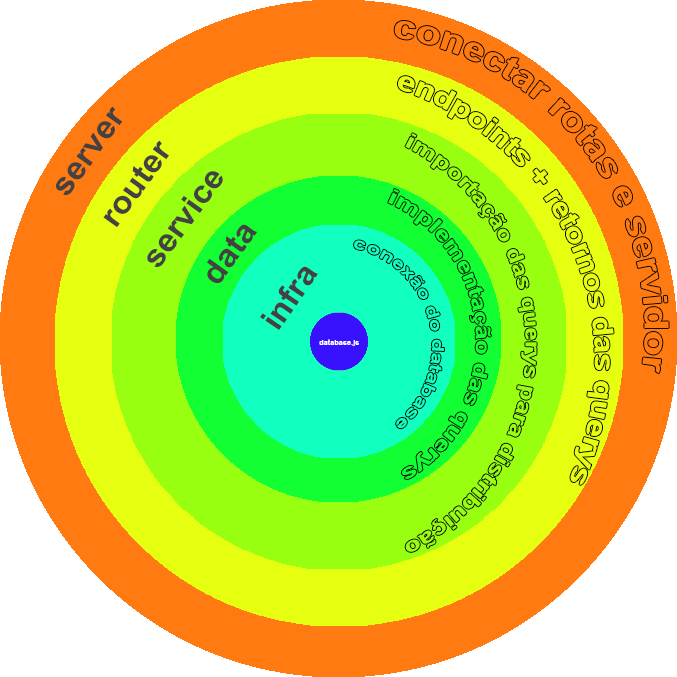

# API REST + MYSQL

## Resumo

Esta API possui uma conexão com o banco de dados MYSQL, o intuíto do banco é mostrar uma lista de games, e também os awards, nele tem o ***Golden Joystick Award***, onde é listado todos os games vancedores até 2022.

Com o REST podemos acessar as rotas para listar todos os games vencedores do ***Golden Joystick Award***, filtrar vencedores por ano, e também, fazer filtros de consultas ao DB por todos games cadastrados no DB, incluir, atualizar e deletar.

## DataBase

No diretório **/database** possui o arquivo **/database/create.sql** que contém os comandso SQL para a criação do banco e das tabelas para você pode realizar os testes localmente.

## Estrutura em Camadas desta API
Esta estrutura delega melhor as regras de negócio para cada camada tornado o fluxo e manutenção melhor.

